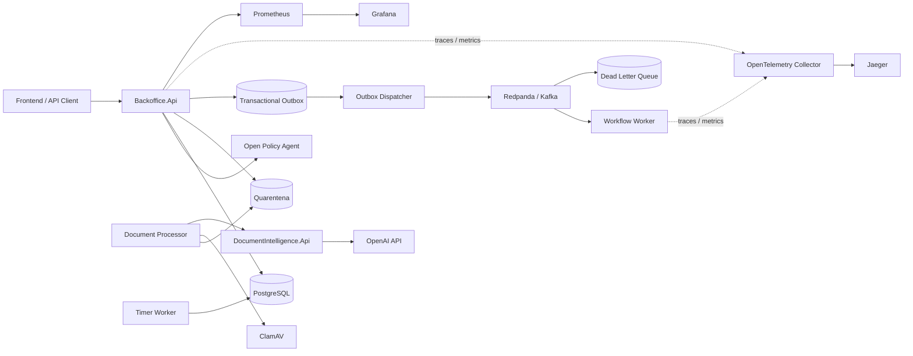

# Intelligent Backoffice Platform API

[](https://github.com/leandrosflora/backoffice-platform-api/actions/workflows/ci.yml)
[](https://dotnet.microsoft.com/)
[](https://github.com/leandrosflora/intelligent-backoffice-platform-architecture)
[](#production-readiness)

Backend executável em **ASP.NET Core / .NET 9** para uma plataforma inteligente de backoffice com gestão de casos, processamento documental com IA, autorização por policies, aprovação humana, execução governada, eventing confiável e observabilidade.

Este repositório implementa o backend de produto da arquitetura de referência [Intelligent Backoffice Platform Architecture](https://github.com/leandrosflora/intelligent-backoffice-platform-architecture).

> **Princípio central:** a IA analisa e recomenda; o workflow controla o processo; policies determinam o que pode ser feito; pessoas aprovam decisões sensíveis; serviços de domínio executam operações idempotentes.

## O que este projeto demonstra

A solução implementa uma jornada bancária de contestação com:

1. abertura e triagem do caso;
2. recebimento e validação de documentos;
3. classificação e extração documental com IA;
4. investigação e produção de evidências;
5. recomendação explicável;
6. aprovação humana conforme papel e alçada;
7. execução idempotente;
8. reconciliação, auditoria e encerramento;
9. processamento assíncrono com outbox, Kafka, workers, timers e DLQ.

## Capacidades implementadas

- monólito modular com separação entre Domain, Application, Infrastructure e API;
- lifecycle persistente de casos com controle de versão otimista;
- isolamento multi-tenant;
- PostgreSQL com Entity Framework Core e migrations;
- autorização externa com Open Policy Agent e comportamento `default deny`;
- identidade por headers para desenvolvimento ou JWT EdDSA no perfil seguro;
- upload real de PDF, PNG, JPEG, DOCX e XLSX;
- armazenamento durável em volume, com zonas separadas de quarentena e aceitos;
- malware scanning real com ClamAV antes de qualquer análise ou promoção;
- processamento documental assíncrono, retomável e fail-closed;
- serviço independente de Document Intelligence integrado à OpenAI;
- abstention por limiar de confiança para evitar classificações forçadas;
- human-in-the-loop e validação de alçada;
- execução governada com `Idempotency-Key`;
- transactional outbox, Redpanda/Kafka, workers, timers, DLQ e replay;
- OpenTelemetry, Prometheus, Grafana e Jaeger;
- health check e readiness check;
- testes de domínio, aplicação, API, contratos, OPA, Kafka e IA;
- evals determinísticos versionados com thresholds e guardrails;
- imagens Docker e perfis de execução local;
- manifests Kubernetes para a arquitetura alvo.

## Arquitetura



## Ecossistema

| Repositório | Responsabilidade |
|---|---|
| [intelligent-backoffice-platform-architecture](https://github.com/leandrosflora/intelligent-backoffice-platform-architecture) | Arquitetura, contratos, policies, observabilidade, ADRs e documentação publicada |
| [backoffice-platform-api](https://github.com/leandrosflora/backoffice-platform-api) | Backend .NET, persistência, policies, IA documental, eventing e workers |
| [intelligent-backoffice-frontend](https://github.com/leandrosflora/intelligent-backoffice-frontend) | Console React para operar e validar a jornada |

## Stack tecnológica

| Área | Tecnologia |
|---|---|
| Runtime | .NET 9 e ASP.NET Core Minimal APIs |
| Persistência | PostgreSQL 16, Entity Framework Core e Npgsql |
| Policies | Open Policy Agent — OPA |
| Eventing | Redpanda / Kafka e Confluent.Kafka |
| IA documental | OpenAI SDK, tool calling e Open XML SDK |
| Resiliência | Polly, processamento retomável e promoção idempotente |
| Segurança documental | Quarentena em volume e ClamAV |
| Identidade | Headers locais ou JWT EdDSA |
| Observabilidade | OpenTelemetry, Prometheus, Grafana e Jaeger |
| Empacotamento | Docker e Docker Compose |
| Orquestração alvo | Kubernetes |
| Testes | xUnit, integration tests, OPA real e Kafka real |

## Estrutura do repositório

```text
.
├── src/
│   ├── Backoffice.Domain/              # Entidades, invariantes e lifecycle
│   ├── Backoffice.Application/         # Use cases, handlers e ports
│   ├── Backoffice.Infrastructure/      # EF Core, OPA, Kafka, JWT e observabilidade
│   ├── Backoffice.Api/                 # API HTTP principal
│   ├── Backoffice.Workers/             # Documentos, outbox, workflow e timers
│   ├── Backoffice.Evals/               # Harness de avaliações determinísticas
│   └── DocumentIntelligence.Api/       # Serviço independente de análise documental
├── tests/                               # Testes unitários, integração e contratos
├── evals/                               # Datasets e thresholds de avaliação
├── deploy/                              # Artefatos de deployment
├── docker-compose.yml
└── Backoffice.sln
```

## Pré-requisitos

- Git;
- Docker com Docker Compose;
- uma chave válida da OpenAI;
- .NET SDK 9 para build e testes locais;
- OPA CLI e Docker daemon para executar a suíte completa de testes.

O `docker-compose.yml` reutiliza policies e configurações de observabilidade do repositório de arquitetura. Por isso, mantenha os dois repositórios como diretórios irmãos:

```text
workspace/
├── intelligent-backoffice-platform-architecture/
└── backoffice-platform-api/
```

## Início rápido

### 1. Clonar os repositórios

```bash
git clone https://github.com/leandrosflora/intelligent-backoffice-platform-architecture.git
git clone https://github.com/leandrosflora/backoffice-platform-api.git
cd backoffice-platform-api
```

### 2. Configurar a OpenAI

Linux ou macOS:

```bash
export OPENAI_API_KEY="sua-chave"
export OPENAI_MODEL="gpt-4o"
```

PowerShell:

```powershell
$env:OPENAI_API_KEY="sua-chave"
$env:OPENAI_MODEL="gpt-4o"
```

### 3. Subir o runtime mínimo

```bash
docker compose --profile runtime up -d --build
```

Esse perfil inicia:

- PostgreSQL;
- OPA;
- ClamAV;
- Document Intelligence;
- Backoffice API;
- worker de processamento documental.

### 4. Validar a execução

```bash
curl http://localhost:8080/health
curl http://localhost:8080/health/ready
```

Respostas esperadas:

```json
{"status":"ok"}
```

```json
{"status":"ready"}
```

### 5. Criar um caso

No perfil padrão, a identidade é informada por headers para facilitar desenvolvimento e testes locais.

```bash
curl --request POST http://localhost:8080/v1/cases \
  --header "Content-Type: application/json" \
  --header "X-Tenant-Id: demo-bank" \
  --header "X-Subject-Id: analyst-001" \
  --header "X-Roles: case-manager,auditor" \
  --data '{
    "externalReference": "DISPUTE-2026-0001",
    "disputeType": "PIX",
    "channel": "APP",
    "priority": "NORMAL",
    "disputedAmount": {
      "currency": "BRL",
      "amount": "250.00"
    }
  }'
```

A resposta contém `caseId`, `state` e `caseVersion`. O `caseVersion` deve ser enviado no header `If-Match` nas operações protegidas por concorrência otimista.

## Perfis Docker Compose

| Perfil | Objetivo | Serviços principais |
|---|---|---|
| `runtime` | Jornada mínima | API, PostgreSQL, OPA, ClamAV, Document Intelligence e worker documental |
| `distributed` | Eventing e processamento assíncrono | Runtime, Redpanda e workers especializados |
| `observability` | Métricas, traces e dashboards | Runtime, Prometheus, Grafana, Jaeger e OTel Collector |
| `secure` | Identidade JWT validada | API segura, PostgreSQL, OPA, ClamAV, Document Intelligence e worker documental |

### Runtime distribuído

```bash
docker compose --profile distributed up -d --build
```

Serviços adicionais:

- `outbox-dispatcher`;
- `workflow-worker`;
- `timer-worker`;
- `document-processor`;
- tópicos `backoffice.events.v1` e `backoffice.dlq.v1`.

### Observabilidade

```bash
docker compose --profile observability up -d --build
```

| Serviço | URL local |
|---|---|
| API | http://localhost:8080 |
| Document Intelligence | http://localhost:8090 |
| OPA | http://localhost:8181 |
| Prometheus | http://localhost:9090 |
| Grafana | http://localhost:3000 |
| Jaeger | http://localhost:16686 |

Credenciais locais padrão do Grafana: `admin` / `admin`.

### Perfil seguro

```bash
docker compose --profile secure up -d --build
```

A API segura fica em `http://localhost:8082` e exige um JWT válido. Nesse modo, os headers de identidade informados pelo cliente não substituem as claims validadas do token.

## Configuração principal

| Variável | Padrão | Descrição |
|---|---|---|
| `OPENAI_API_KEY` | obrigatório | Credencial usada pelo Document Intelligence |
| `OPENAI_MODEL` | `gpt-4o` | Modelo com suporte a visão e tool calling |
| `APP_PORT` | `8080` | Porta da API no perfil runtime |
| `SECURE_APP_PORT` | `8082` | Porta da API no perfil seguro |
| `DISTRIBUTED_APP_PORT` | `8081` | Porta da API no perfil distribuído |
| `DOCUMENT_INTELLIGENCE_PORT` | `8090` | Porta do serviço de análise documental |
| `OPA_PORT` | `8181` | Porta do OPA |
| `REDPANDA_PORT` | `19092` | Porta Kafka exposta localmente |
| `PROMETHEUS_PORT` | `9090` | Porta do Prometheus |
| `GRAFANA_PORT` | `3000` | Porta do Grafana |
| `JAEGER_PORT` | `16686` | Porta da interface do Jaeger |

Configurações internas relevantes:

```text
ConnectionStrings__Backoffice
Opa__BaseUrl
DocumentIntelligence__BaseUrl
DocumentStorage__RootPath
DocumentStorage__MaxUploadBytes
DocumentProcessing__Inline
MalwareScan__Mode
MalwareScan__ClamAv__Host
MalwareScan__ClamAv__Port
MalwareScan__ClamAv__TimeoutSeconds
Identity__Mode
Otel__Endpoint
Kafka__BootstrapServers
Kafka__EventsTopic
Kafka__DlqTopic
Kafka__ConsumerGroup
Worker__Role
```

## Headers de requisição

| Header | Uso |
|---|---|
| `X-Tenant-Id` | Tenant obrigatório no modo de identidade por headers |
| `X-Subject-Id` | Identificador do ator |
| `X-Roles` | Papéis separados por vírgula avaliados pelas policies |
| `X-Subject-Type` | `HUMAN` ou `WORKLOAD`; padrão local: `HUMAN` |
| `X-Correlation-Id` | Correlação ponta a ponta; um UUID é criado quando ausente |
| `If-Match` | Versão esperada do caso para operações concorrentes |
| `Idempotency-Key` | Obrigatório para solicitar execução governada |
| `X-Authority-Limit` | Alçada do aprovador no modo de desenvolvimento por headers |
| `Authorization` | Bearer token no perfil JWT |

## Superfície HTTP

### Saúde

| Método | Endpoint | Descrição |
|---|---|---|
| `GET` | `/health` | Liveness do processo |
| `GET` | `/health/ready` | Readiness com verificação do PostgreSQL |

### Casos

| Método | Endpoint | Descrição |
|---|---|---|
| `POST` | `/v1/cases` | Criar caso |
| `GET` | `/v1/cases` | Listar casos do tenant |
| `GET` | `/v1/cases/{caseId}` | Consultar caso |
| `POST` | `/v1/cases/{caseId}/cancel` | Cancelar caso com `If-Match` |
| `GET` | `/v1/cases/{caseId}/timeline` | Consultar timeline auditável |

### Documentos e evidências

| Método | Endpoint | Descrição |
|---|---|---|
| `POST` | `/v1/cases/{caseId}/documents` | Armazenar documento em quarentena e agendar processamento |
| `GET` | `/v1/cases/{caseId}/documents/{documentId}` | Consultar documento |
| `GET` | `/v1/cases/{caseId}/evidence` | Listar evidências do caso |
| `POST` | `/v1/documents/analyze` | Endpoint interno do Document Intelligence |

O upload usa `multipart/form-data` com os campos:

- `file`;
- `documentType`: `RECEIPT`, `STATEMENT`, `TRANSACTION_PROOF` ou `IDENTITY_PROOF`;
- `mediaType`: `APPLICATION_PDF`, `IMAGE_PNG`, `IMAGE_JPEG`, `APPLICATION_DOCX` ou `APPLICATION_XLSX`.

Exemplo:

```bash
curl --request POST "http://localhost:8080/v1/cases/{caseId}/documents" \
  --header "X-Tenant-Id: demo-bank" \
  --header "X-Subject-Id: analyst-001" \
  --header "X-Roles: case-manager,document-processor,auditor" \
  --header "If-Match: 1" \
  --form "documentType=RECEIPT" \
  --form "mediaType=APPLICATION_PDF" \
  --form "file=@receipt.pdf;type=application/pdf"
```

O endpoint responde `202 Accepted` depois de persistir o arquivo e os metadados, normalmente
com status `QUARANTINED`. O `document-processor` retoma itens `QUARANTINED` ou `VALIDATING`,
envia os bytes ao ClamAV e só então chama o Document Intelligence. Consulte
`GET /v1/cases/{caseId}/documents/{documentId}` até um estado terminal:
`VALIDATED`, `REVIEW_REQUIRED` ou `REJECTED`.

Arquivos limpos são copiados de forma idempotente para a zona `accepted`; a cópia em
quarentena fica disponível para uma futura política de retenção. Indisponibilidade,
timeout ou resposta inesperada do scanner não libera o arquivo: ele permanece
`VALIDATING` e é tentado novamente.

### Investigação, decisão e execução

| Método | Endpoint | Descrição |
|---|---|---|
| `POST` | `/v1/cases/{caseId}/investigations` | Iniciar investigação |
| `POST` | `/v1/cases/{caseId}/recommendations` | Criar recomendação |
| `POST` | `/v1/cases/{caseId}/approvals` | Registrar decisão humana |
| `POST` | `/v1/cases/{caseId}/executions` | Solicitar execução idempotente |
| `GET` | `/v1/cases/{caseId}/executions` | Listar execuções |
| `GET` | `/v1/cases/{caseId}/executions/{executionId}` | Consultar execução |
| `POST` | `/v1/cases/{caseId}/reconciliations/{executionId}/resolve` | Resolver reconciliação |

### Operação assíncrona

| Método | Endpoint | Descrição |
|---|---|---|
| `POST` | `/v1/operations/cases/{caseId}/timers` | Agendar timer |
| `GET` | `/v1/operations/outbox` | Inspecionar outbox |
| `GET` | `/v1/operations/dead-letters` | Inspecionar DLQ |
| `GET` | `/v1/operations/timers` | Inspecionar timers |
| `POST` | `/v1/operations/dead-letters/{deadLetterId}/replay` | Reprocessar dead letter |

## Document Intelligence

O serviço `DocumentIntelligence.Api` é separado do domínio de contestação. Ele recebe um arquivo e devolve:

```json
{
  "documentType": "RECEIPT",
  "confidence": 0.92,
  "extractedFields": [
    {
      "name": "amount",
      "value": "250.00",
      "confidence": 0.95
    }
  ],
  "abstained": false,
  "rationale": "Document structure and fields are consistent with a receipt."
}
```

Controles implementados:

- o arquivo permanece em quarentena até um resultado limpo do ClamAV;
- checksum SHA-256 é calculado no servidor e verificado novamente antes do scan;
- referências de storage são opacas e validadas contra path traversal;
- uploads acima de 10 MiB são rejeitados antes da cópia em memória;
- o conteúdo do documento é tratado como dado não confiável;
- a resposta é estruturada por tool calling;
- a única ferramenta permitida registra a análise;
- documentos abaixo do `DocumentAnalysis:ConfidenceFloor` resultam em abstention;
- falha ou indisponibilidade do serviço degrada para abstention, não para uma classificação inventada;
- DOCX e XLSX são extraídos localmente com Open XML antes do envio ao modelo;
- PDF e imagens são enviados como conteúdo multimodal.

## Build, testes e evals

```bash
dotnet restore
dotnet build --configuration Release
dotnet test --configuration Release
dotnet run --project src/Backoffice.Evals --configuration Release
```

A suíte cobre:

- invariantes e transições de domínio;
- handlers de aplicação;
- endpoints e isolamento multi-tenant;
- concorrência otimista;
- autorização OPA real;
- identidade JWT e rejeição de spoofing por headers;
- idempotência e reconciliação;
- outbox, Kafka, workers, timers e DLQ;
- contratos HTTP e eventos;
- análise documental com fixtures gravadas;
- abstention, grounding e thresholds de avaliação.

O pipeline de CI executa restore, build, testes, evals determinísticos e validação das regras Prometheus.

## Segurança e governança

- OPA externo com decisão centralizada e `default deny`;
- enforcement fail-closed para autorização;
- isolamento por tenant em leituras e mutações;
- controle otimista por `caseVersion` e `If-Match`;
- idempotência obrigatória nas execuções;
- identidade de desenvolvimento separada do modo JWT;
- JWT com issuer, audience e TTL máximo;
- rejeição de headers de identidade quando há token validado;
- quarentena durável e promoção somente após malware scan limpo;
- falhas do scanner mantêm o documento bloqueado para nova tentativa;
- trilha de auditoria com actor, correlation ID, causation ID e rule references;
- abstention explícita para resultados de IA de baixa confiança;
- DLQ e replay governado para falhas assíncronas.

## Production readiness

O status atual é **`NOT_PRODUCTION_READY`**.

O projeto demonstra capacidades executáveis localmente e no CI, mas ainda não representa uma plataforma produtiva completa. Antes de produção são necessários, entre outros:

- identidade corporativa e gestão real de chaves;
- secrets manager e rotação de credenciais;
- object storage gerenciado, criptografia/KMS, retenção e descarte da cópia em quarentena;
- leasing distribuído antes de escalar o worker documental acima de uma réplica;
- operação, atualização de assinaturas e alta disponibilidade do ClamAV;
- integração com sistemas de registro;
- testes E2E entre frontend, backend e dependências;
- observabilidade e SLOs operados em ambiente real;
- alta disponibilidade e disaster recovery validados;
- threat modeling, pentest e hardening;
- gestão de custos e quotas da IA;
- processo formal de mudança, rollout e rollback;
- revisão regulatória, jurídica, LGPD e segurança.

## Documentação relacionada

- [Documentação publicada da arquitetura](https://leandrosflora.github.io/intelligent-backoffice-platform-architecture/)
- [Repositório de arquitetura](https://github.com/leandrosflora/intelligent-backoffice-platform-architecture)
- [Backend de produto](https://github.com/leandrosflora/intelligent-backoffice-platform-architecture/blob/master/docs/implementation/backend-product.md)
- [Runtime integrado](https://github.com/leandrosflora/intelligent-backoffice-platform-architecture/blob/master/docs/implementation/product-runtime.md)
- [Estado de implementação](https://github.com/leandrosflora/intelligent-backoffice-platform-architecture/blob/master/docs/architecture/implementation-status.md)
- [Architecture Decision Records](https://github.com/leandrosflora/intelligent-backoffice-platform-architecture/tree/master/docs/decisions)
- [Production readiness](https://github.com/leandrosflora/intelligent-backoffice-platform-architecture/blob/master/docs/governance/production-readiness.md)

## Encerrar o ambiente

```bash
docker compose --profile runtime down
docker compose --profile distributed down
docker compose --profile observability down
docker compose --profile secure down
```

Para remover também os volumes locais:

```bash
docker compose --profile runtime down --volumes
```
